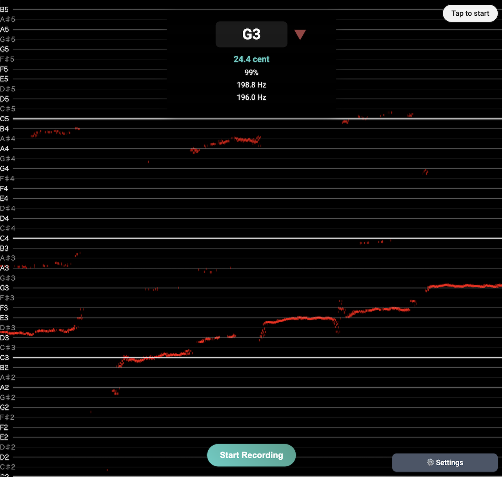

# pitch-detector

A real-time pitch detection and tuner web application

## Overview

This app captures audio from the user's microphone and detects pitch (frequency) in real time, visualizing the results. Detected pitches are displayed on a musical staff and with a tuning indicator, providing clear feedback on note names and scale tones.

## Features

- Real-time pitch detection from microphone input
- Musical staff display of note names and scale tones
- Tuning indicator with cent deviation
- Multiple note name systems (CDEFGAB, Do Re Mi Fa So La Ti, etc.)
- Major/minor scale selection
- Oscilloscope view of audio waveform
- Customizable A4 reference frequency

## Demo



https://cho45.stfuawsc.com/pitch-detector/

## Setup & Usage

This is a static web app with no build process. Simply serve `index.html` with any HTTP server.

```bash
# Example: Start with Python's simple HTTP server
python -m http.server 8000
# Or
npx serve .
```

Access `http://localhost:8000` in your browser.
